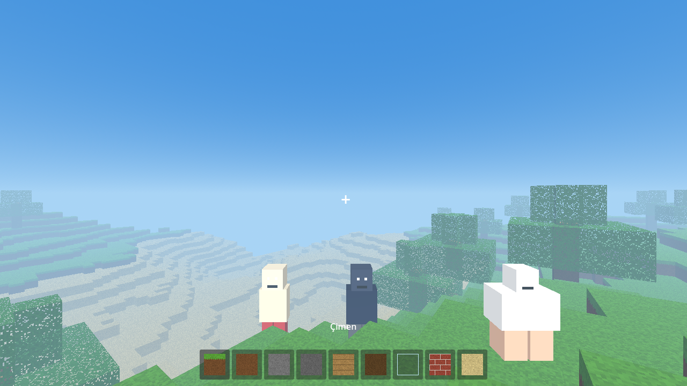

# EmirCRAFT

Blok tabanlı, mobil (Android/iOS) hayatta kalma ve inşa oyunu. Godot 4.3 ile yazılıyor.

- Teknik plan ve yol haritası: [docs/PLAN.md](docs/PLAN.md)
- Karakter ve doku görsel istemleri: [docs/gorsel-istemleri.md](docs/gorsel-istemleri.md)

## Hızlı başlangıç
1. [Godot 4.3](https://godotengine.org/download) indir.
2. Godot'ta **Import** → bu klasördeki `project.godot`.
3. **F5** ile çalıştır.

Bilgisayar kontrolleri: WASD hareket, Space zıpla, fare bak, sol tık kır/vur, sağ tık koy, 1-9 blok seç.
Telefonda: sol yarıda joystick, sağ yarıda sürükleyerek bak, sağ alttaki Zıpla / Kır / Koy düğmeleri. Kır düğmesi önündeki yaratığa vurur.
